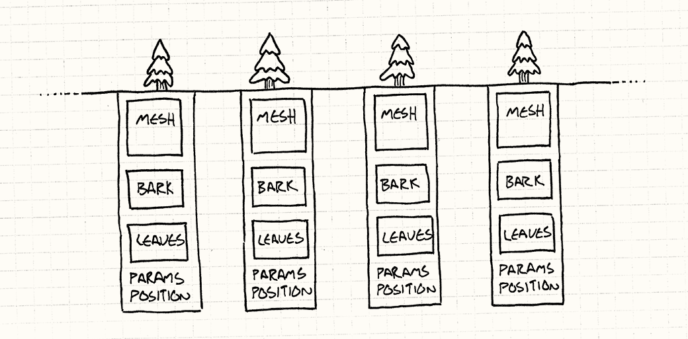

## Design Patterns, the importance and implementations
  Design patterns are a set of rules or guidelines that you loosely follow whether it be conciously or unconciously. In art this could manifest in the form of a uniform artstyle you produced, while in writing this could be shown with a concurrent theme or motif that coccurs throughout a plot. Design patterns are important points that differentiate your works from the general populations and establish a general purpose for your creation. As a student of a programming related major, design patterns are integral when coding. design patterns can be used to initiate a central theme to the project, and/or simplify the organization for the code.

Design patterns aren't a mutually exclusive aspects. Patterns can be mutated to adhere to the situation/needs for the specific purpose of your creation. When i had been buiding a unity game, the movement with keyboard inputs adhered to a design pattern that allowed for manipulating the character model for lifelike movement. Design patterns can be as broad as a general goal for a set of code, or as minute as the settings per a pair of entitites. Object oriented programming can be interpreted as a design for sets of data within programming languages. The objects could be manipulated and created with data, variables, and methods.

In my programming, Object oriented programming is one of my design patterns, however inheritance can also be seen as another form of design patterns used whenever I code in programming. Inheritance utuilizes preexisting designs and mutate them in diffreernt entities that share the core structure of the objext its inheriting from. Numbered lists are also another form of a design pattern, being a reiteration of the format through multiple elements within a list of values.

Design Patterns encompass a wide reange of your creative choices, in many areas you never realized. Creative operations such as game design and front end development usually have an explicit tendency to focus on this technique, but other computer science tasks such as back end development and database management still contains design patterns that may escape your perception. In an average persons life, design patterns will be seen everyday whether it be in network infastructure in yur home, or art that you look at for leisure.
