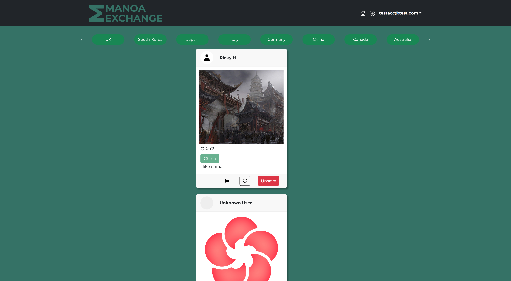
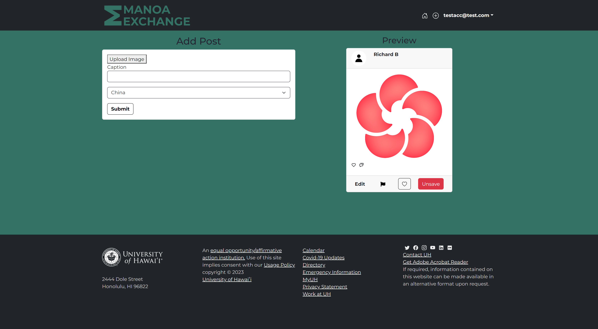

<p align="center">
  
</p>


## Introduction
  Throughout the ICS 314 software engineering course, I gained new skills in html/css and meteor that allowed me to gain more understanding of web development, which in turn allowed me to assist my team in creating the website we elected to make for our final project. Our website "manoa exchange" is a website that seeked to solve the problem that UH Manoa students faced, which is the lack of information to foreign exchange experiences of peers and how to access them. Our website is designed to allow users to post a card of information into the site that contains a picture usually of the person's experience in a country, a tag that labes which country it was, and text that describes the experience. Our primary goal for this site was to make a slim down restricted version of a reddit thread to foreign exchange students or hopefuls of UH manoa.

## Backend
  The portion of the project I had been responsible for was mainly working on the my profile page, and the backend to the website along with another teammate. Our team distributed tasks among the five of us which adhered to our preferences, or availiblity of the task. Our website had a key focus of allowing users/students to create profiles that contain basic information such as school email id and name, and allow them to post information of their hopes or experiences in foreign exchange programs in a way similar to social media apps like twitter and websites like reddit.

### Profile Page
  The profile page was made with a simplistic design where the left portion of the page contained a column composed of 2 react bootstrap card components that contained the user's profile picture, full name, student id number, and email, while the right portion rendered all of the posts the student made in the website. When bulding theb webpage, I managed to learn how to utilize react bootstrap classes better and more efficiently, with the card and grid classes being the most prevalent react components I used in this portion.

<p align="center">
  
</p>


This is the code for the profile page of the website:

```jsx
import React from 'react';
import { Meteor } from 'meteor/meteor';
import { Link } from 'react-router-dom';
import { Button, Card, Col, Container, Row } from 'react-bootstrap';
import { useTracker } from 'meteor/react-meteor-data';
import LoadingSpinner from '../components/LoadingSpinner';
import { Profiles } from '../../api/profile/Profile';
import { Posts } from '../../api/post/Post';
import { Comments } from '../../api/comment/Comment';
import PostItem from '../components/PostItem';
import '../css/PostItem.css';
import { PageIDs } from '../utilities/ids';
import NavBar from '../components/NavBar';

const MyProfile = () => {
  const { ready, posts, comments, profiles } = useTracker(() => {
    const subscription = Meteor.subscribe(Profiles.userPublicationName);
    const subscription2 = Meteor.subscribe(Posts.userPublicationName);
    const subscription3 = Meteor.subscribe(Comments.userPublicationName);

    const rdy = subscription.ready() && subscription2.ready() && subscription3.ready();

    const profileData = Profiles.collection.find({}).fetch();
    const postData = Posts.collection.find({}, { sort: { createdAt: -1 } }).fetch();
    const commentData = Comments.collection.find({}).fetch();

    return {
      profiles: profileData,
      posts: postData,
      comments: commentData,
      ready: rdy,
    };
  }, []);

  const userProfile = profiles.find(profile => profile.owner === Meteor.user().username);

  return ready ? (
    <div id={PageIDs.myProfilePage}>
      <NavBar />
      <Container className="mb-4">
        <Row className="mt-4">
          <Col lg={4}>
            <Card className="mb-4 rounded border border-dark card_profile antw">
              <Card.Body className="text-center">
                <div className="d-flex justify-content-center mb-4">
                  
                </div>
                <Link to="/uploadWidget"><Button className="custom-update-button">Add/Edit Profile Picture</Button></Link>
                <h3 className="mb-1 mt-3">{userProfile?.firstName || 'Insert Name'} {userProfile?.lastName || 'Insert Name'}</h3>
                <p className="text-muted mb-4">{userProfile?.idNumber}</p>
              </Card.Body>
            </Card>
            <Card className="mb-4 mt-4 border border-dark antw">
              <Card.Body>
                <Row className="mb-2">
                  <Col sm="3">
                    <Card.Text>Name</Card.Text>
                  </Col>
                  <Col sm="9">
                    <Card.Text className="text-muted">{userProfile?.firstName || 'Insert Name'} {userProfile?.lastName || 'Insert Name'}</Card.Text>
                  </Col>
                </Row>
                <Row>
                  <Col sm="3">
                    <Card.Text>E-mail</Card.Text>
                  </Col>
                  <Col sm="9">
                    <Card.Text className="text-muted">{userProfile?.owner || 'Insert Name'} </Card.Text>
                  </Col>
                </Row>
              </Card.Body>
            </Card>
          </Col>
          <Col lg={8}>
            <Card className="mb-4 border border-black antw">
              <Card.Header as="h3" className="text-center">Recent Posts</Card.Header>
            </Card>
            {posts.map((post) => {
              const relatedComments = comments.filter(comment => comment.uniqueId === post._id);
              return (
                <Col md={12} key={post._id} className="mb-4">
                  <PostItem
                    post={post}
                    comments={relatedComments || []}
                  />
                </Col>
              );
            })}
          </Col>
        </Row>
      </Container>
    </div>
  ) : <LoadingSpinner />;
};

export default MyProfile;
```

### Add Post
Other than the profile page, I worked on the backend for a portion of the post items, and the home page. The posts are filled with information gained from teh create post form, alongside subscfriptions from multiple databases. I added the tags collection to contain a dataset of all countries a post could be affiliated with. The tags collection is loaded on server startup with 20 countries that offer foreign exchange programs within UH, and the collection itself is then used to display the tags within the home page and create post page.

On the create post page, I placed a select element into the form to gather user data for the country affiliated with the post they would publish towards the site. The options to select were generated from the tags collection that was made on server startup. After the user clicks the submit button, the post is created, ans stored ina posts collection, while another collection called posttags recieves teh input of the posts unique id and the selected country tag, recieving an element with both pieces of information acting as a link for the tag and post.

<p align="center">
  
</p>

### Home Page

The home page utilizes the tags to populate a carousel that my teammate designed with the possible countries that can be the tags of posts. In the home page, I designed the tags to be displayed as buttons that can be clicked to filter through posts by the tags the posts are affiliated with. Every tag is clickable and redirects the user to a page where only posts with the chosen tags are rendered to the page. I learned how to redirect users to a page related to the element they clicked with the link components that take input from the button to redirect users to a url with the input information mutating the output url. The page you are redirected to is a filter page with the id of the tag, that you recieve in order to filter through the post tags collection to render posts that contain only that tag. The carousel ensures that the buttons will only take one row of space in the home page, making the efficiency rate higher.

## Conclusion

Overall this was a thrilling experience that gave me insght into the usual practices that occur in web development, and how web developers cooperate in teams to develop the variety of aspects that compose a site. I learned various new skills and enhanced my understanding of impportant knowledge pertaining to javascipt html web development and how to launch it for the public to experience. My comprehension of the steps needed to create a frontend and backend experience for a web application enhanced further with this projects completion.

The project home page can be found with [This](https://manoa-exchange.github.io/) link
